# 🏗️ WanderWhiz Visual Architecture

## System Architecture Diagram

```mermaid
graph TB
    subgraph "🖥️ Frontend Layer"
        A[📱 HTML5/CSS3] 
        B[⚡ JavaScript ES6+]
        C[🗺️ Google Maps JS API]
        D[📲 Responsive Design]
    end
    
    subgraph "⚙️ Backend Services"  
        E[🐍 Flask Application]
        F[🔧 Python 3.8+]
        G[🛣️ Route Processing]
        H[🔐 Session Management]
    end
    
    subgraph "🤖 AI & Intelligence"
        I[🧠 OpenAI GPT-4]
        J[🎯 Natural Language Processing]
        K[📝 Intent Recognition]
    end
    
    subgraph "🌍 Google Cloud APIs"
        L[📍 Places API]
        M[🛣️ Routes API] 
        N[🌐 Geocoding API]
        O[🗺️ Maps JavaScript API]
    end
    
    subgraph "💾 Data Layer"
        P[🔥 Firebase Firestore]
        Q[📊 Trip Storage]
        R[👤 User Sessions]
    end
    
    subgraph "☁️ Deployment"
        S[🚀 Vercel Platform]
        T[🌐 Global CDN]
        U[🔒 HTTPS/SSL]
    end
    
    %% Data Flow Connections
    A --> E
    B --> E
    C --> E
    E --> I
    E --> L
    E --> M
    E --> N
    I --> J
    J --> K
    L --> G
    M --> G
    N --> G
    E --> P
    P --> Q
    P --> R
    E --> S
    S --> T
    S --> U
    
    %% Styling
    classDef frontend fill:#e3f2fd,stroke:#1976d2,stroke-width:2px
    classDef backend fill:#f3e5f5,stroke:#7b1fa2,stroke-width:2px
    classDef ai fill:#fff3e0,stroke:#f57c00,stroke-width:2px
    classDef google fill:#e8f5e8,stroke:#388e3c,stroke-width:2px
    classDef data fill:#fce4ec,stroke:#c2185b,stroke-width:2px
    classDef deploy fill:#f1f8e9,stroke:#689f38,stroke-width:2px
    
    class A,B,C,D frontend
    class E,F,G,H backend
    class I,J,K ai
    class L,M,N,O google
    class P,Q,R data
    class S,T,U deploy
```

## Data Flow Architecture

```mermaid
sequenceDiagram
    participant U as 👤 User
    participant F as 🖥️ Frontend
    participant B as ⚙️ Backend
    participant AI as 🧠 OpenAI
    participant G as 🌍 Google APIs
    participant DB as 💾 Firebase
    
    U->>F: "Plan romantic Paris trip"
    F->>B: POST /gpt-assist
    B->>AI: Natural language processing
    AI-->>B: {city: "Paris", interests: ["romantic", "cafes"]}
    
    B->>G: Search places in Paris
    G-->>B: Places data with coordinates
    
    B->>G: Calculate optimal routes
    G-->>B: Route with polylines
    
    B->>DB: Save itinerary
    DB-->>B: Document ID
    
    B-->>F: Complete itinerary JSON
    F->>F: Render map & places
    F-->>U: Interactive trip display
```

## Technology Stack Diagram

## Performance Optimization Flow

```mermaid
graph TD
    A[User Request] --> B{API Optimization}
    B -->|Before| C[80+ places processed]
    B -->|After| D[40 places maximum]
    
    D --> E{Database Optimization}
    E --> F[Singleton Pattern]
    E --> G[Query Limiting]
    E --> H[Connection Reuse]
    
    F --> I{Frontend Optimization}
    G --> I
    H --> I
    
    I --> J[Lazy Loading]
    I --> K[Caching]
    I --> L[Minification]
    
    J --> M[⚡ 0.94s Response Time]
    K --> M
    L --> M
    
    style C fill:#ffcdd2
    style D fill:#c8e6c9
    style M fill:#4caf50,color:#fff
```

## Deployment Architecture

```mermaid
graph TB
    subgraph "Development"
        A[👩‍💻 Local Development]
        B[🔧 VS Code]
        C[🐍 Python Environment]
    end
    
    subgraph "Version Control"
        D[📁 GitHub Repository]
        E[🔄 Git Workflow]
        F[📝 Documentation]
    end
    
    subgraph "CI/CD Pipeline"
        G[🔍 Code Push]
        H[✅ Automated Testing]
        I[📦 Build Process]
        J[🚀 Auto Deploy]
    end
    
    subgraph "Production"
        K[☁️ Vercel Platform]
        L[🌐 Global CDN]
        M[🔒 HTTPS/SSL]
        N[📊 Analytics]
    end
    
    A --> D
    B --> D
    C --> D
    D --> G
    E --> G
    F --> G
    G --> H
    H --> I
    I --> J
    J --> K
    K --> L
    K --> M
    K --> N
    
    classDef dev fill:#e3f2fd
    classDef git fill:#f3e5f5
    classDef cicd fill:#fff3e0
    classDef prod fill:#e8f5e8
    
    class A,B,C dev
    class D,E,F git
    class G,H,I,J cicd
    class K,L,M,N prod
```

---

## 🎨 How to View These Diagrams

### On GitHub:
1. Push this file to GitHub
2. GitHub automatically renders Mermaid diagrams
3. You'll see beautiful visual diagrams with colors and icons

### For More Professional Diagrams:
1. **Draw.io**: Copy the components and create with actual library logos
2. **Lucidchart**: Professional diagramming tool
3. **Figma**: Design-focused with real icons

**These Mermaid diagrams will show as actual visual flowcharts on GitHub!** 🎯
