# WanderWhiz Visual Architecture Diagrams

## How to Create Professional Visual Diagrams

Since you want **actual visual diagrams with library icons and live arrow connections**, here are the exact steps to create them:

## Option 1: Draw.io (Recommended - FREE)

1. **Open Draw.io**: Go to https://app.diagrams.net/
2. **Choose Template**: Select "Software Architecture" or "AWS Architecture"
3. **Import Icons**: 
   - Go to "More Shapes" → "Software" → "Logos"
   - Add: Python, Flask, Google Cloud, Firebase, OpenAI, JavaScript
4. **Create Diagram**: Use the components below

### Components to Add:
- **Frontend**: HTML5, CSS3, JavaScript logos
- **Backend**: Python + Flask logos  
- **AI**: OpenAI GPT-4 logo
- **Maps**: Google Maps Platform logo
- **Database**: Firebase/Firestore logo
- **Hosting**: Vercel logo

## Option 2: Lucidchart (Professional)

1. **Sign up**: https://lucidchart.com
2. **Use Templates**: Choose "Software Architecture" 
3. **Drag & Drop**: Add technology icons with connections

## Option 3: Mermaid Diagrams (Code-based)

Let me create a Mermaid diagram that GitHub can render:

```mermaid
graph TB
    subgraph "Frontend Layer"
        A[📱 HTML5/CSS3/JS] 
        B[🗺️ Google Maps JS API]
        C[📲 Responsive Design]
    end
    
    subgraph "Backend Layer"  
        D[🐍 Flask Application]
        E[🔧 Python Logic]
        F[🛣️ Route Optimization]
    end
    
    subgraph "AI Services"
        G[🧠 OpenAI GPT-4]
        H[🎯 NLP Processing]
    end
    
    subgraph "Google APIs"
        I[📍 Places API]
        J[🛣️ Routes API] 
        K[🌍 Geocoding API]
    end
    
    subgraph "Database"
        L[🔥 Firebase Firestore]
        M[💾 Trip Storage]
    end
    
    subgraph "Deployment"
        N[☁️ Vercel Hosting]
        O[🌐 Global CDN]
    end
    
    A --> D
    B --> D
    D --> G
    D --> I
    D --> J
    D --> K
    D --> L
    G --> H
    I --> F
    J --> F
    L --> M
    D --> N
    N --> O
    
    style A fill:#e1f5fe
    style D fill:#f3e5f5
    style G fill:#fff3e0
    style L fill:#e8f5e8
    style N fill:#fce4ec
```

## Option 4: Figma (Design Tool)

1. **Create Account**: https://figma.com
2. **Use Components**: Search for tech logos and icons
3. **Create Flowcharts**: With arrows and connections

## Option 5: Excalidraw (Hand-drawn Style)

1. **Open**: https://excalidraw.com
2. **Draw**: Hand-drawn style architecture diagrams
3. **Export**: As PNG or SVG

---

## Immediate Action Required:

**Please choose your preferred method:**

1. **Quick & Free**: I'll create more Mermaid diagrams
2. **Professional**: You use Draw.io with the components I listed
3. **Collaborative**: We use Figma together

**What would you prefer?** I can guide you through any of these options to create the exact visual diagrams you want with library icons and live arrow connections.
